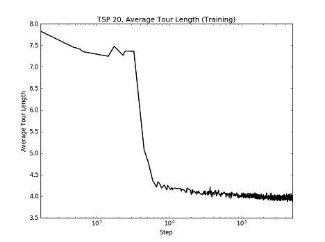
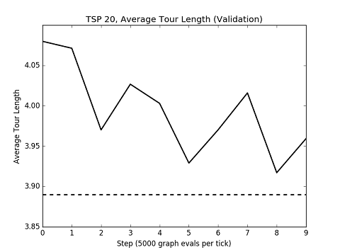
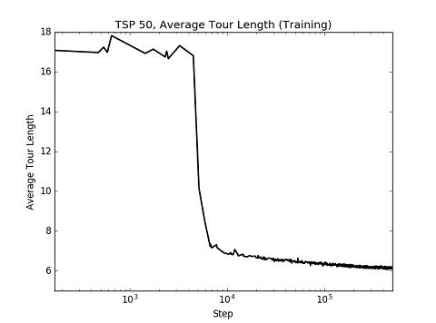
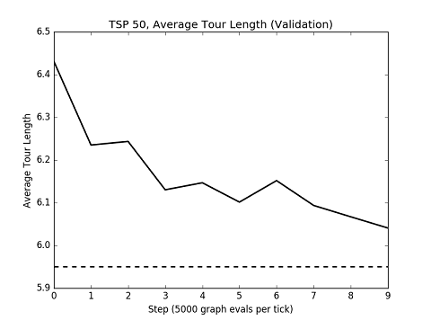

# neural-combinatorial-rl-pytorch

PyTorch implementation of [Neural Combinatorial Optimization with Reinforcement Learning](https://arxiv.org/abs/1611.09940). 

I have implemented the basic RL pretraining model with greedy decoding from the paper. An implementation of the supervised learning baseline model is available [here](https://github.com/pemami4911/neural-combinatorial-rl-tensorflow). Instead of a critic network, I got my results below on TSP from using an exponential moving average critic. The critic network is simply commented out in my code right now. From correspondence with a few others, it was determined that the exponential moving average critic significantly helped improve results. 

My implementation uses a stochastic decoding policy in the pointer network, realized via PyTorch's `torch.multinomial()`, during training, and beam search (**not yet finished**, only supports 1 beam a.k.a. greedy) for decoding when testing the model. 

Currently, there is support for a sorting task and the planar symmetric Euclidean TSP.

See `main.sh` for an example of how to run the code.

Use the `--load_path $LOAD_PATH` and `--is_train False` flags to load a saved model.

To load a saved model and view the pointer network's attention layer, also use the `--plot_attention True` flag.

Please, feel free to notify me if you encounter any errors, or if you'd like to submit a pull request to improve this implementation.

## Adding other tasks

This implementation can be extended to support other combinatorial optimization problems. See `sorting_task.py` and `tsp_task.py` for examples on how to add. The key thing is to provide a dataset class and a reward function that takes in a sample solution, selected by the pointer network from the input, and returns a scalar reward. For the sorting task, the agent received a reward proportional to the length of the longest strictly increasing subsequence in the decoded output (e.g., `[1, 3, 5, 2, 4] -> 3/5 = 0.6`).

## Dependencies

* Python=3.6 (should be OK with v >= 3.4)
* PyTorch=0.2 and 0.3
* tqdm
* matplotlib
* [tensorboard_logger](https://github.com/TeamHG-Memex/tensorboard_logger)

PyTorch 0.4 compatibility is available on branch `pytorch-0.4`.

## TSP Results

Results for 1 random seed over 50 epochs (each epoch is 10,000 batches of size 128). After each epoch, I validated performance on 1000 held out graphs. I used the same hyperparameters from the paper, as can be seen in `main.sh`. The dashed line shows the value indicated in Table 2 of Bello, et. al for comparison. The log scale x axis for the training reward is used to show how the tour length drops early on.






## Sort Results

I trained a model on `sort10` for 4 epochs of 1,000,000 randomly generated samples. I tested it on a dataset of size 10,000. Then, I tested the same model on `sort15` and `sort20` to test the generalization capabilities.

Test results on 10,000 samples (A reward of 1.0 means the network perfectly sorted the input): 

| task | average reward | variance | 
|---|---|---|
| sort10 | 0.9966 | 0.0005 |
| sort15 | 0.7484 | 0.0177 |
| sort20 | 0.5586 | 0.0060 | 


Example prediction on `sort10`: 

```
input: [4, 7, 5, 0, 3, 2, 6, 8, 9, 1]
output: [0, 1, 2, 3, 4, 5, 6, 7, 8, 9]
```

### Attention visualization

Plot the pointer network's attention layer with the argument `--plot_attention True`

## TODO

* [ ] Add RL pretraining-Sampling
* [ ] Add RL pretraining-Active Search
* [ ] Active Search
* [ ] Asynchronous training a la A3C
* [X] Refactor `USE_CUDA` variable
* [ ] Finish implementing beam search decoding to support > 1 beam
* [ ] Add support for variable length inputs

## Acknowledgements

Special thanks to the repos [devsisters/neural-combinatorial-rl-tensorflow](https://github.com/devsisters/neural-combinatorial-rl-tensorflow) and [MaximumEntropy/Seq2Seq-PyTorch](https://github.com/MaximumEntropy/Seq2Seq-PyTorch) for getting me started, and @ricgama for figuring out that weird bug with `clone()`

